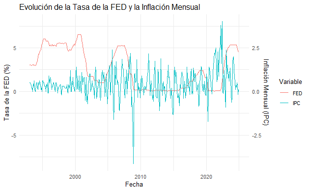
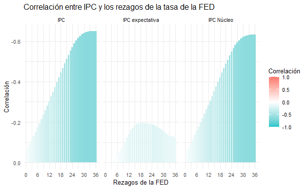
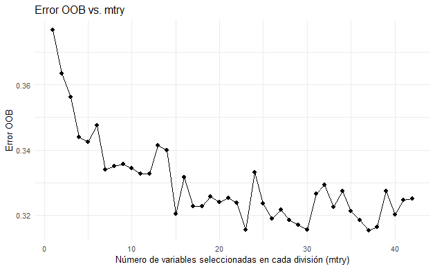
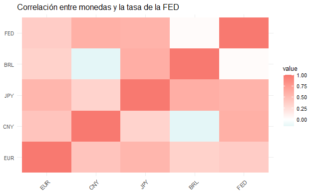

# Predictive Models for Interest Rate

This project examines the relationship between the Federal Reserve's interest rate and inflation, focusing on its global impact on currencies. Using historical data and models like regression and Random Forest, it shows the delayed effects on inflation and the immediate impact on exchange rates.

## Relationship Between FED & CPI

After loading the data, a correlation analysis was performed between the FED's interest rate and the CPI, aiming to understand how fluctuations in interest rates affect inflation levels. While the monthly correlation was weak, a clearer relationship emerged when the data was analyzed on an annual basis, suggesting that the FED's impact on inflation may be more pronounced over the long term. In addition to the CPI, other inflation indicators, such as core CPI and inflation expectations, were included to provide a broader and more robust context for understanding how the FED's monetary policy influences economic behavior. These indicators were analyzed using statistical techniques and predictive models.

 

## Model

To predict inflation behavior based on interest rates, various predictive models, including regression and Random Forest, were trained. These models were used to identify patterns and make predictions, providing insight into how the FED influences the CPI and other economic indicators over time.

# Predictive Models for Interest Rate

This project examines the relationship between the Federal Reserve's interest rate and inflation, focusing on its global impact on currencies. Using historical data and models like regression and Random Forest, it shows the delayed effects on inflation and the immediate impact on exchange rates.

## Relationship Between FED & CPI

After loading the data, a correlation analysis was performed between the FED's interest rate and the CPI, aiming to understand how fluctuations in interest rates affect inflation levels. While the monthly correlation was weak, a clearer relationship emerged when the data was analyzed on an annual basis, suggesting that the FED's impact on inflation may be more pronounced over the long term. In addition to the CPI, other inflation indicators, such as core CPI and inflation expectations, were included to provide a broader and more robust context for understanding how the FED's monetary policy influences economic behavior. These indicators were analyzed using statistical techniques and predictive models.
 
  

## Model

To predict inflation behavior based on interest rates, various predictive models, including regression and Random Forest, were trained. These models were used to identify patterns and make predictions, providing insight into how the FED influences the CPI and other economic indicators over time.

 

'''{r}
>>>>>>> Stashed changes
# Normalize the data (except 'Date')
filtered_df_norm <- filtered_df %>%
  mutate(across(-Date, ~ as.numeric(scale(.))))

# Define predictor variables
fed_lags <- names(filtered_df_norm)[grepl("FED_lag_", names(filtered_df_norm))]

# Create dynamic formula for the model
formula_rf <- as.formula(paste("IPC_core_Monthly ~", paste(fed_lags, collapse = " + ")))

# Split into 'train' and 'test'
set.seed(54)  # Reproducibility
trainIndex <- createDataPartition(filtered_df_norm$IPC_core_Monthly, p = 0.8, list = FALSE)
trainData <- filtered_df_norm[trainIndex, ]
testData <- filtered_df_norm[-trainIndex, ]

# Train Random Forest model
model_rf <- randomForest(formula_rf, data = trainData, ntree = 500)

# Predictions
predictions <- predict(model_rf, newdata = testData)

# Metrics: Mean Squared Error & R^2
mse <- mean((predictions - testData$IPC_core_Monthly)^2)
rsq <- 1 - sum((predictions - testData$IPC_core_Monthly)^2) / sum((testData$IPC_core_Monthly - mean(testData$IPC_core_Monthly))^2)

print(paste("MSE: ", mse))
print(paste("R-squared: ", rsq))

# Variable importance
importance(model_rf)
'''

## Hyperparameters

During the modeling phase, hyperparameters of the models were tuned to improve accuracy. Parameters such as tree depth in Random Forest were adjusted to achieve more precise and reliable results. Hyperparameters were evaluated using techniques like cross-validation and out-of-bag (OOB) error.

 

## Global Impact

One of the key aspects of this project was analyzing the global impact of the FED's monetary policy, particularly on foreign exchange rates. It was found that changes in the FED's interest rate have an immediate effect on foreign currencies, indicating that markets respond quickly to FED decisions on a global scale.

 
 
## Conclusion

The analysis concluded that the FED's interest rate has a significant impact on inflation, but its effects are gradual and long-term. In contrast, the impact of the FED's monetary policy on exchange rates is immediate and direct. This highlights the importance of the FED not only in the U.S. economy but also in the global economy, as its decisions affect both domestic inflation and the stability of foreign currencies.