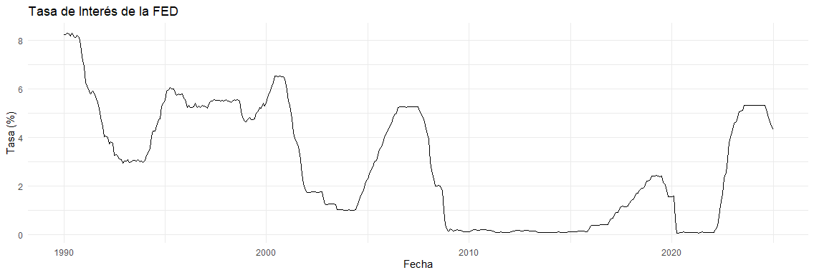
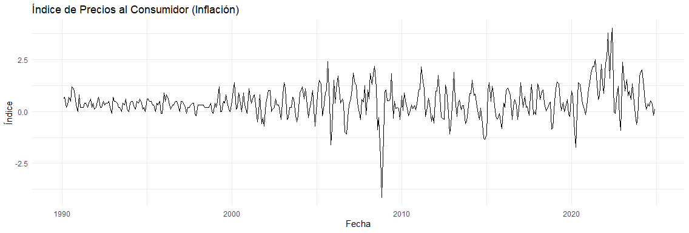
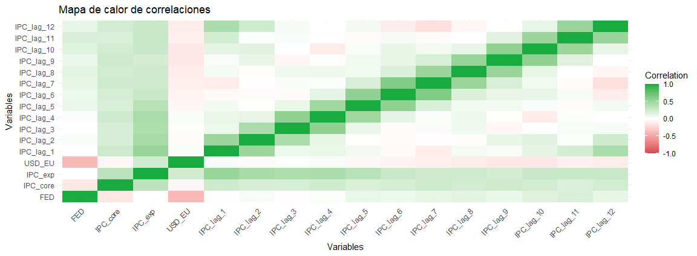
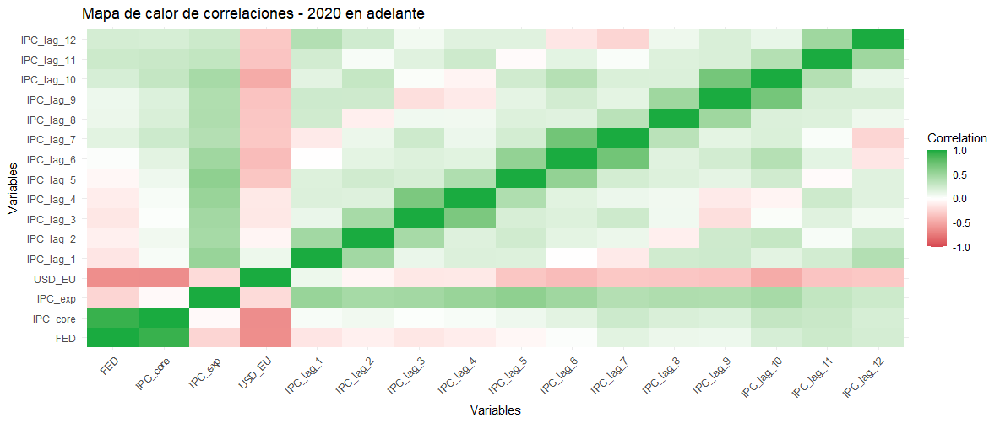
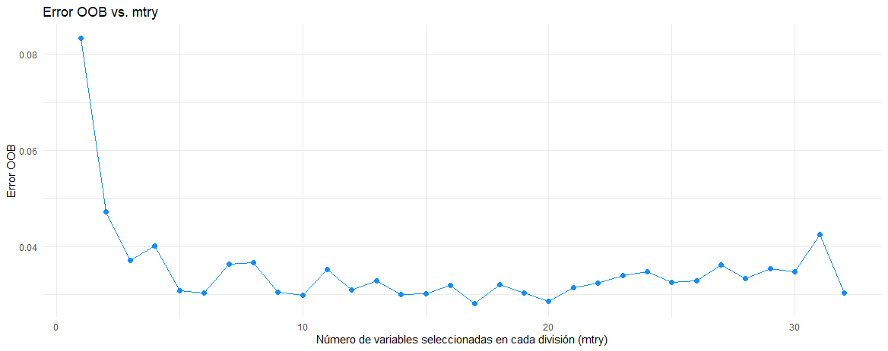

# **Interest Rate Impact Analysis with Predictive Models**

This project explores predicting **FED trends** using **Random Forest** models, leveraging economic indicators such as CPI and the Dollar Exchange Rate. The dataset, sourced from [FRED - Federal Reserve Bank of St. Louis](https://fred.stlouisfed.org/), spans historical data starting from 1990.

### Key Objectives:  
- Analyze correlations between economic variables and the **FED**.  
- Identify relevant features using **heat maps** and **lagged variables**.  
- Optimize the **Random Forest** model through **hyperparameter tuning**.  
- Evaluate model performance with **Mean Squared Error (MSE)** and **R²**.  

### Summary of Findings:  
- **IPC_core** emerged as the most influential variable.  
- The best-performing model achieved **MSE: 0.0097** and **R²: 0.9907** after tuning.  
- The **2020-2025 projection** confirmed strong variable correlations, refining our feature selection.  

This analysis provides a robust forecasting approach for **FED trends**, leveraging machine learning to enhance economic modeling and decision-making.

---

## **1. Exploratory Data Analysis**

We analyzed data from **1990 onward** and observed a significant correlation, particularly with the **previous month's IPC** and the **same month from the previous year**. Including additional variables highlighted the importance of `IPC_core`.

The historical trend of the `FED` variable over time is shown below:  

  

Similarly, the **IPC index** over the analyzed period shows relevant patterns:  

  

To quantify relationships between variables, we computed a **correlation heat map**:  

  

An analysis of the expected trends for **2020-2025** revealed even stronger correlations, which guided us in focusing on this period:  

  

---

## **2. Data Preprocessing**

To prepare the data for modeling, we applied the following steps:
- Convert categorical variables into numerical values.
- Normalize all features except for the `Date` column.
- Split the dataset into **training (80%)** and **testing (20%)** sets.

```r
# Convert categorical columns to numeric
filtered_df[] <- lapply(filtered_df, function(x) {
  if (is.factor(x) || is.character(x)) {
    as.numeric(as.character(x))
  } else {
    x
  }
})

# Normalize the data (excluding 'Date')
filtered_df_norm <- filtered_df %>%
  mutate(across(-Date, scale))

# Train-test split
set.seed(54) 
trainIndex <- createDataPartition(filtered_df_norm$FED, p = 0.8, list = FALSE)
trainData <- filtered_df_norm[trainIndex, ]
testData <- filtered_df_norm[-trainIndex, ]
```

---

## **3. Training the Initial Random Forest Model**

We trained the initial **Random Forest** model using a subset of predictors:

```r
model_rf <- randomForest(FED ~ IPC_core + IPC_exp + USD_EU + IPC_lag_1 + IPC_lag_2, data = trainData)
predictions <- predict(model_rf, newdata = testData)
```

---

## **4. Model Evaluation**

We evaluated the model using **Mean Squared Error (MSE)** and **R² (coefficient of determination)**:

```r
mse <- mean((predictions - testData$FED)^2)
rsq <- 1 - sum((predictions - testData$FED)^2) / sum((testData$FED - mean(testData$FED))^2)

print(paste("MSE: ", mse))
print(paste("R-squared: ", rsq))
```

**Initial Results:**
- **MSE:** `0.2360`
- **R²:** `0.7743`

---

## **5. Feature Importance Analysis**

To determine which variables contribute most to predictions, we analyzed feature importance:

```r
importance(model_rf)
```

| Feature    | Importance (IncNodePurity) |
|------------|---------------------------|
| IPC_core   | 12.06                      |
| USD_EU     | 8.60                       |
| IPC_exp    | 1.49                        |

---

## **6. Hyperparameter Tuning**

To improve model performance, we optimized the `mtry` parameter (number of variables considered at each split) using **Out-of-Bag (OOB) error**.

```r
# Testing different mtry values
mtry_values <- 1:(ncol(trainData) - 1)
oob_errors <- numeric(length(mtry_values))

for (i in mtry_values) {
  rf_model <- randomForest(FED ~ ., data = trainData, mtry = i, ntree = 500)
  oob_errors[i] <- rf_model$mse[length(rf_model$mse)]
}

# Plotting OOB error vs mtry
df <- data.frame(mtry = mtry_values, oob_error = oob_errors)
ggplot(df, aes(x = mtry, y = oob_error)) +
  geom_point(color = "#118DFF", size = 2) +
  geom_line(color = "#118DFF") +
  ggtitle("OOB Error vs. mtry")
```

The following plot shows the **OOB error** as a function of `mtry`:  

  

---

## **7. Cross-Validation & Final Model Training**

To find the optimal value for `mtry`, we performed **cross-validation**:

```r
rf_tuned <- train(FED ~ ., data = trainData, 
                  method = "rf", 
                  tuneGrid = expand.grid(mtry = seq(2, ncol(trainData) - 1, by = 2)))

print(rf_tuned$bestTune)
```

**Best `mtry` Found:** `30`

Using this value, we trained the **final model**:

```r
model_rf <- randomForest(FED ~ ., data = trainData, mtry = 30, ntree = 500)
predictions <- predict(model_rf, newdata = testData)

# Final evaluation
mse <- mean((predictions - testData$FED)^2)
rsq <- 1 - sum((predictions - testData$FED)^2) / sum((testData$FED - mean(testData$FED))^2)

print(paste("MSE: ", mse))
print(paste("R-squared: ", rsq))
```

**Final Results:**
- **MSE:** `0.0097`
- **R²:** `0.9907`

This demonstrates a **significant improvement** over the initial model.

---

## **8. Conclusion**

- The **initial model** achieved an **R² of 0.7743**, indicating moderate accuracy.
- Feature importance analysis highlighted **IPC_core** and **USD_EU** as key variables.
- After **hyperparameter tuning** (`mtry = 30`), the model improved dramatically, reaching an **R² of 0.9907** and a much lower **MSE**.
- The final model provides a highly accurate **FED trend prediction** based on economic indicators.

---

## **9. Data Source**

The dataset was obtained from **FRED (Federal Reserve Economic Data)**:  
🔗 [FRED - Federal Reserve Bank of St. Louis](https://fred.stlouisfed.org/)
